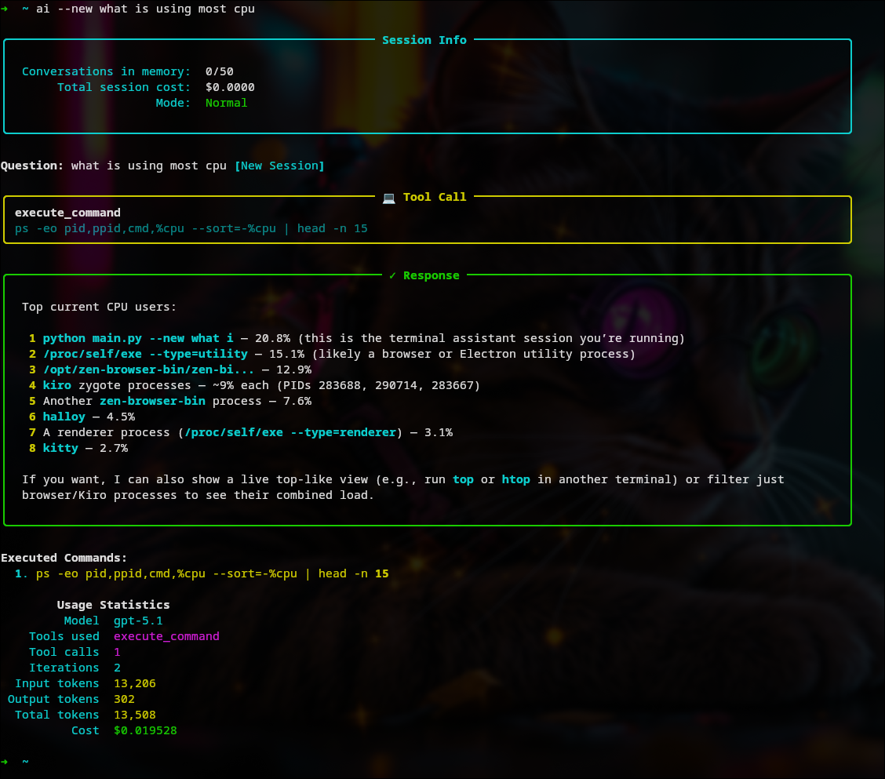

# 🤖 Lolo - AI Terminal Assistant

Your friendly AI companion for the command line. Ask questions in plain English and let Lolo handle the rest.



**Example usage:**

```bash
ai "What's using all my CPU?"
ai "Find my biggest files"
ai "What's the weather in Tokyo?"
```

## ✨ Features

- 🧠 **GPT-5.1 powered** - Latest OpenAI model with reasoning
- 🌐 **Web search** - Real-time search with citations
- 🖼️ **Image analysis** - Understand images from files or URLs
- 🎨 **Image generation** - Create images with FLUX.1 (optional)
- ✏️ **Image editing** - Edit existing images with text prompts (optional)
- 💻 **Terminal access** - Execute commands with safety checks
- 💾 **Memory** - Remembers your conversations
- 🔒 **Safe mode** - Ask-only mode for learning without changes

## 📋 Requirements

- **Python 3.8+** (check with `python --version`)
- **UV package manager** ([install guide](https://docs.astral.sh/uv/getting-started/installation/))
- **Chrome/Chromium** (for JavaScript-rendered pages)
- **OpenAI API key** ([get one here](https://platform.openai.com/api-keys))

Optional:
- **fastfetch** (for detailed system info, falls back to basic info if not available)
- **BFL API key** (for image generation and editing, [get one here](https://api.bfl.ai/))

## 🚀 Quick Start

```bash
# 1. Clone and setup
git clone https://github.com/mathisen99/AI-terminal-tool.git
cd AI-terminal-tool
chmod +x setup.sh
./setup.sh

# 2. Add your OpenAI API key
cp .env.example .env
nano .env  # Add your API key

# 3. Try it
source .venv/bin/activate
python main.py "What's the weather today?"
```

### Make it Global (Optional)

Add to your `~/.zshrc`:

```bash
ai() {
    local original_dir="$PWD"
    (cd /path/to/AI-terminal-tool && source .venv/bin/activate && ORIGINAL_CWD="$original_dir" python main.py "$@")
}
```

Now use `ai "your question"` from anywhere!

## 💬 Usage

```bash
# Normal mode (continues conversation)
ai "Show me my disk space"

# Fresh start
ai --new "Tell me about Python"

# Safe mode (no system changes)
ai --ask "How do I use grep?"
```

## 🎯 What Can You Ask?

**System**
- "Check my disk space"
- "What's using my CPU?"
- "Update my system"

**Files**
- "Find my biggest files"
- "List all images in my home folder"
- "Create a backup of my documents"

**Web**
- "What's the weather in Paris?"
- "Search for Python news"
- "Summarize this page: https://example.com"

**Images**
- "What's in this screenshot?"
- "Generate an image of a sunset"
- "Edit this image and make the car red"
- "Analyze ~/Pictures/photo.jpg"

## 🔒 Safety

- Dangerous commands require confirmation
- Cost limits ($0.50 warning, $2.00 abort)
- All commands logged to `~/.lolo/command_log.txt`
- Use `--ask` mode for safe exploration

## ⚙️ Configuration

Edit `config/settings.py`:

```python
DEFAULT_MODEL = "gpt-5.1"
DEFAULT_REASONING_EFFORT = "none"  # none, low, medium, high
DEFAULT_VERBOSITY = "medium"       # low, medium, high
```

## 📁 Project Structure

```
├── main.py              # Entry point
├── config/              # Settings and configuration
├── services/            # OpenAI, memory, caching
├── tools/               # Web search, images, terminal
├── utils/               # Performance monitoring
└── docs/                # API documentation
```

## 🐛 Troubleshooting

**UV not found?**
```bash
curl -LsSf https://astral.sh/uv/install.sh | sh
```

**API key errors?**
```bash
cat .env  # Check your .env file format
```

**Clear memory?**
```bash
ai --new "Start fresh"
```

## 📚 Documentation

Detailed docs in the `docs/` folder:
- `GPT_51.md` - Model configuration
- `Function_calling.md` - Tool definitions
- `web_search.md` - Web search syntax
- `image_usage.md` - Image analysis
- `PERFORMANCE_OPTIMIZATION.md` - Optimization guide

## 🤝 Contributing

Contributions welcome! Fork, create a feature branch, and open a PR.

## 📄 License

MIT License - see [LICENSE](LICENSE) file.

## 🙏 Credits

Built with OpenAI GPT-5.1, Rich, UV, Selenium, and undetected-chromedriver.

---

**Built for terminal enthusiasts who want AI without leaving the command line.**
